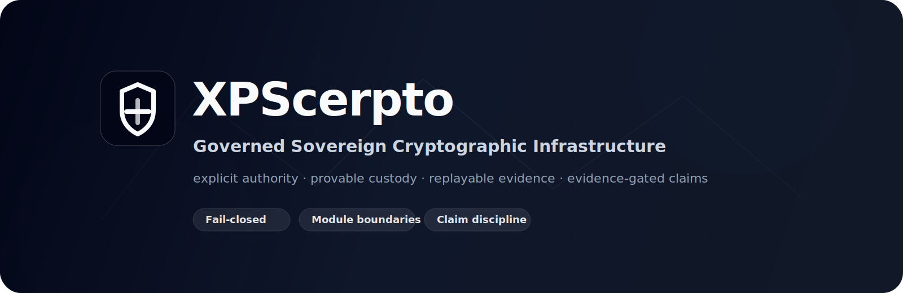
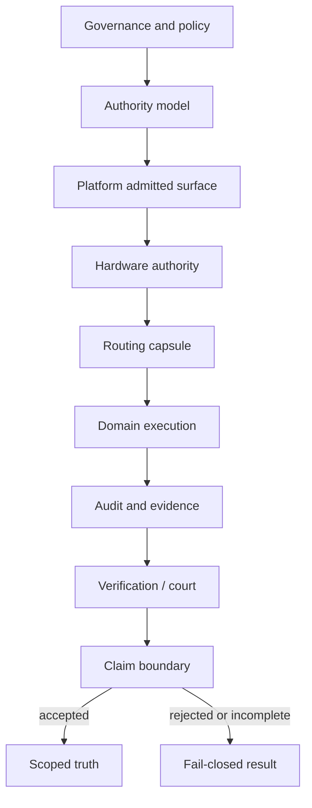

<p align="center">
  
</p>

<div align="center">

# XPScerpto

### Governed sovereign cryptographic infrastructure for sensitive systems

**Explicit authority · Controlled access · Provable custody · Replayable evidence · Evidence-gated claims**

[](#current-claim-boundaries)
[](#current-claim-boundaries)
[](#current-claim-boundaries)
[](#claim-discipline)
[](#license)

[Project website](https://xpscerpto.eu) · [GitHub organization](https://github.com/xpscerpto) · [Security](SECURITY.md) · [Start here](START_HERE.md)

</div>

---

## Definition

**XPScerpto** is a governed sovereign cryptographic infrastructure platform for sensitive systems.

It subjects **authority, access, custody, evidence, and operational behavior** to replayable proof. The platform connects **governance, access control, supply-chain control, verification, audit, and advanced cryptographic layers**, including classical cryptography, post-quantum cryptographic domains, and encrypted-computing domains, under one disciplined model.

XPScerpto is not organized as a loose collection of cryptographic utilities. It is structured as a governed platform where **execution authority, validation evidence, module boundaries, failure behavior, and public claims** must remain aligned with proven truth.

---

## Current claim boundaries

> These flags are not marketing language. They are claim boundaries.
> They protect the repository from accidental overclaim, stale evidence, partial validation, and misleading release status.

| Scope | Current boundary | Meaning |
|---|---:|---|
| Repository production readiness | `PRODUCTION_READY = NO` | No repository-wide production-ready claim is made. |
| Full sanitizer / CTest claim | `FULL_SANITIZER_CTEST_CLAIMED = NO` | No full sanitizer-backed CTest cleanliness claim is made. |
| Full graph acceptance | `FULL_GRAPH_ACCEPTED = NO` | Target-level or partial success is not full graph truth. |
| FHE production readiness | `FHE_PRODUCTION_READY = NO` | FHE progress does not imply production readiness. |
| FHE bootstrap completion | `FHE_BOOTSTRAP_COMPLETE = NO` | Bootstrap closure is not claimed without the relevant gate. |

---

## At a glance

| Area | Role in XPScerpto | Claim discipline |
|---|---|---|
| 🏛️ Governance | Defines authority, review, ownership, and protected-surface policy. | Governance text does not replace live evidence. |
| 🧭 Authority | Controls where execution authority comes from and how it flows. | Domain code must not invent local authority. |
| 🔐 Cryptography | Contains classical, asymmetric, post-quantum, and encrypted-computing domains. | Cryptographic presence is not deployment readiness. |
| 🧬 Verification | Tracks status, claims, evidence, replay, court, temporal rules, and source admission. | Claims must be accepted or rejected by the relevant gate. |
| 🧾 Evidence | Maintains ledgers, runtime records, witnesses, final-court files, and audit artifacts. | Evidence must be replayable and scoped. |
| 🧱 Boundaries | Protects modules, imports, ownership, surfaces, and runtime authority paths. | Boundary violations fail closed. |
| 🧪 Tests and tools | Provide validation, negative tests, scans, replay, and FCC workflows. | Tool success is not automatically repository acceptance. |

---

## Sovereign model



XPScerpto separates capability from authority. A capability may exist on a machine, but that does not make it admitted execution authority.

---

## Modern repository surfaces reflected in this README

The current source tree contains repository surfaces for verification, claims, runtime custody, final-court decisions, witness binding, module graph analysis, command-surface policy, FCC workflows, application/UI assets, and cryptographic execution domains.

This map describes **source-tree structure and architectural responsibility only**. It is not a production-readiness claim.

<details open>
<summary><strong>Core sovereign and verification surfaces</strong></summary>

| Surface | Role |
|---|---|
| `include/xps/crypto/verify/` | Sovereign verification modules, including authority, contracts, court, evidence, replay, runtime, status, temporal verification, claim graph, certification, and trust-engine rules. |
| `verification/` | JSON policy and schema layer for statuses, claims, court rules, source admission, ledger, temporal rules, negative cases, and verification contracts. |
| `claims/` | Claim registries, claim schemas, dependency graphs, and production-ready claim policy. |
| `final_court/` | Final evidence-court verdicts, rejection schemas, final claim state schemas, and production-gate records. |
| `witness/` | Independent witness policy, local witness tokens, witness rejections, and witness binding reports. |
| `runtime/` | Runtime ledgers, session schemas, hash chains, produced/consumed artifacts, replay records, and runtime truth schemas. |
| `module_graph/` | Module graph authority policy, graph edges, verdicts, and rejection records. |
| `command_surface/` | FCC command catalog, help manifest, safe-next policy, thermal gate policy, workflow plan, and command-surface verdicts. |
| `protocol/` | Event and snapshot schemas for command/control and evidence exchange. |
| `include/xps/crypto/test_authority/` | Test-authority layer isolated from production verification ownership. |

</details>

<details>
<summary><strong>Cryptographic and execution domains</strong></summary>

| Surface | Role |
|---|---|
| `include/xps/crypto/base/` | Foundational types, primitives, and low-level policy anchors. |
| `include/xps/crypto/platform/` | Platform root, provider admission, runtime boundary, and OS-facing authority. |
| `include/xps/crypto/platform.api/` | Admitted platform-facing surface. |
| `include/xps/crypto/hw/` | Hardware evidence, topology, authority, and routing support. |
| `include/xps/crypto/simd/` | Authority-routed acceleration and data movement. |
| `include/xps/crypto/FHE/` | Homomorphic encryption, BFV, CKKS, bootstrap, key switching, NTT/RNS, and FHE guards. |
| `include/xps/crypto/hash/`, `kdf/`, `mac/`, `aead/`, `aes/` | Symmetric cryptographic domains. |
| `include/xps/crypto/pqc/`, `ed25519/`, `x25519/`, `rsa/` | Asymmetric and post-quantum cryptographic domains. |
| `include/xps/crypto/number/`, `atomic/`, `memory/`, `integrity/` | Arithmetic, synchronization, memory, and integrity support layers. |
| `include/xps/crypto/audit/` | Evidence, ledgers, and audit-related behavior. |

</details>

<details>
<summary><strong>FCC, tooling, documentation, and UI surfaces</strong></summary>

| Surface | Role |
|---|---|
| `docs/forensic_command_center/` | FCC architecture, control plane, protocol, runtime custody, security model, guided workflow, and integration documentation. |
| `app/server/` | FCC server-side authority helpers and runtime server entrypoints. |
| `app/ui/` | FCC web UI assets. |
| `ui/` | Additional interface assets. |
| `tools/` | Scans, replay utilities, evidence support, and CI helpers. |
| `tests/` | Validation, regression, negative tests, authority tests, and sanitizer-backed testing. |
| `architecture/` | Architecture summaries, domain execution model, evidence custody, platform authority chain, hardware routing, and threat-model companions. |
| `docs/` | Normative and explanatory documentation, including governance, security, verification, command center, and subsystem documents. |
| `.github/` | GitHub-specific project metadata and pull request template. |

</details>

---

## What XPScerpto is

XPScerpto is a governed sovereign cryptographic infrastructure platform with a governance-first and evidence-backed architecture.

It focuses on:

- explicit execution authority;
- controlled access and custody discipline;
- platform-controlled admission;
- source identity and supply-chain control;
- hardware evidence and routing discipline;
- authority-routed SIMD execution;
- cryptographic domain separation;
- classical cryptographic domains;
- post-quantum cryptographic domains;
- encrypted-computing domains, including FHE, BFV, CKKS, and bootstrap validation discipline;
- sovereign verification, claim graph, court, replay, ledger, and evidence layers;
- runtime custody, witness binding, and final-court records;
- strict module boundaries;
- fail-closed behavior;
- evidence-backed testing;
- CI validation gates;
- review and ownership discipline;
- documentation that does not outrun evidence.

The project’s engineering model is based on the principle that correctness, authority, custody, evidence, and claims must describe the same truth.

---

## What XPScerpto is not

XPScerpto is not:

- a normal utility library;
- a collection of unrelated crypto snippets;
- a production-ready claim by default;
- a project where build success implies acceptance;
- a project where sanitizer configuration implies sanitizer cleanliness;
- a project where target-only success implies full graph truth;
- a project where one subsystem’s progress implies platform-wide readiness;
- a project where documentation may outrun implementation evidence;
- a project where cryptographic presence implies deployment readiness;
- a project where a tool verdict automatically becomes repository-wide truth.

Every acceptance claim must be proven by the relevant gate.

---

## Validation discipline

XPScerpto keeps validation levels separate:

```text
configure success ≠ build success
build success ≠ test success
test success ≠ sanitizer truth
target success ≠ full graph truth
subsystem success ≠ repository-wide acceptance
tool verdict ≠ acceptance gate unless explicitly bound
```

A precise partial result is acceptable. A broad claim without matching evidence is not.

---

## Claim discipline

The following kinds of claims require evidence from the relevant gates:

| Claim family | Requires live evidence |
|---|---|
| Production readiness | Yes |
| Production-grade or deployment-ready status | Yes |
| Full graph acceptance | Yes |
| Sanitizer cleanliness | Yes |
| Security hardened status | Yes |
| Full validation | Yes |
| Release acceptance | Yes |
| Subsystem acceptance | Yes |
| FHE / CKKS / BFV acceptance | Yes |
| Bootstrap completion | Yes |
| Full runtime closure | Yes |
| Full materialization closure | Yes |

Equivalent or stronger claims are also covered.

---

## Documentation map

Start here:

```text
START_HERE.md
```

<details open>
<summary><strong>Recommended reading order</strong></summary>

| Order | Document |
|---:|---|
| 1 | `START_HERE.md` |
| 2 | `GOVERNANCE.md` |
| 3 | `ENGINEERING_PRINCIPLES.md` |
| 4 | `AUTHORITY_MODEL.md` |
| 5 | `ARCHITECTURE.md` |
| 6 | `MODULE_BOUNDARIES.md` |
| 7 | `THREAT_MODEL.md` |
| 8 | `SECURITY.md` |
| 9 | `CI_VALIDATION_GATES.md` |
| 10 | `BUILD_AND_VALIDATION_PHILOSOPHY.md` |
| 11 | `REVIEW_POLICY.md` |
| 12 | `CONTRIBUTING.md` |
| 13 | `CONTRIBUTION_AUTHORITY_CLASSES.md` |
| 14 | `OWNERSHIP_MODEL.md` |
| 15 | `CODEOWNERS` |
| 16 | `SUPPORT.md` |
| 17 | `LICENSE_STATUS.md` |
| 18 | `docs/security/README.md` |
| 19 | `docs/governance/README.md` |
| 20 | `docs/verification/README.md` |
| 21 | `docs/forensic_command_center/README.md` |
| 22 | `docs/hw/README.md` |

</details>

<details>
<summary><strong>Key documentation families</strong></summary>

| Family | Entry point |
|---|---|
| Repository governance | `GOVERNANCE.md` |
| Engineering discipline | `ENGINEERING_PRINCIPLES.md` |
| Authority model | `AUTHORITY_MODEL.md` |
| Module boundaries | `MODULE_BOUNDARIES.md` |
| Validation gates | `CI_VALIDATION_GATES.md` |
| Security reporting | `SECURITY.md` |
| Verification documents | `docs/verification/README.md` |
| Security specifications | `docs/security/README.md` |
| Governance process | `docs/governance/README.md` |
| Forensic Command Center | `docs/forensic_command_center/README.md` |
| HW subsystem | `docs/hw/README.md` |
| Architecture companions | `architecture/README.md` |

</details>

Root-level documents remain the repository-wide policy sources. Subdirectory documentation specializes or explains those policies; it does not override them unless the root-level policy explicitly says so.

---

## Protected surfaces

Changes to protected surfaces require clear scope, appropriate review, and evidence.

<details>
<summary><strong>Protected repository surfaces</strong></summary>

```text
include/xps/crypto/base/
include/xps/crypto/platform/
include/xps/crypto/platform.api/
include/xps/crypto/hw/
include/xps/crypto/simd/
include/xps/crypto/FHE/
include/xps/crypto/hash/
include/xps/crypto/kdf/
include/xps/crypto/mac/
include/xps/crypto/aead/
include/xps/crypto/aes/
include/xps/crypto/pqc/
include/xps/crypto/ed25519/
include/xps/crypto/x25519/
include/xps/crypto/rsa/
include/xps/crypto/number/
include/xps/crypto/atomic/
include/xps/crypto/memory/
include/xps/crypto/integrity/
include/xps/crypto/audit/
include/xps/crypto/verify/
include/xps/crypto/test_authority/
verification/
claims/
runtime/
final_court/
witness/
module_graph/
command_surface/
protocol/
app/
ui/
tests/
tools/
docs/
architecture/
governance/
.github/
CMakeLists.txt
```

</details>

Protected surfaces must not be changed through hidden shortcuts, weakened tests, deleted assertions, fake fallbacks, metadata-only proofs, or production overclaims.

---

## Build and validation reporting

Build and validation details vary by platform, compiler, generator, and configured options.

When reporting build or test results, identify:

| Required field | Why it matters |
|---|---|
| Source tree or commit | Prevents stale or mismatched evidence. |
| Compiler and version | C++23 module behavior is toolchain-sensitive. |
| CMake version | Build graph generation is part of the evidence. |
| Generator | Ninja/Makefiles and graph behavior may differ. |
| Build configuration | Debug, Release, sanitizer, and module modes differ. |
| Commands executed | Scope must be reproducible. |
| Tests run | Targeted success is not full graph truth. |
| Sanitizer runtime status | Configuration alone is not cleanliness. |
| Failures or skipped tests | Missing evidence must stay visible. |
| Exact blocker | Incomplete results must fail closed with precision. |

Do not report a validation claim without enough evidence to support it.

---

## Security

Do not report vulnerabilities through public issues, pull requests, discussions, public website forms, or social media posts.

Use:

```text
SECURITY.md
```

for vulnerabilities and security-sensitive reports.

Security-sensitive topics include:

- secret key or private key exposure;
- seed, token, credential, or secret material leakage;
- cryptographic correctness failures with security impact;
- authority bypasses;
- platform or provider bypasses;
- unauthorized hardware routing or SIMD dispatch;
- memory safety findings in protected paths;
- CI, evidence, or release manipulation;
- documentation claims that could mislead users about security or readiness.

If unsure whether an issue is security-sensitive, treat it as security-sensitive.

---

## Support

For non-security questions, use:

```text
SUPPORT.md
```

Support topics include build help, installation help, non-security bug reports, documentation clarification, test execution questions, and contribution workflow questions.

Do not include secrets, private keys, tokens, exploit details, private data, or active vulnerability reproduction steps in public support channels.

---

## Contributing

Contributions are welcome when they are clear, scoped, and evidence-backed.

Before contributing, read:

```text
CONTRIBUTING.md
REVIEW_POLICY.md
MODULE_BOUNDARIES.md
CI_VALIDATION_GATES.md
SECURITY.md
```

A pull request should explain what changed, why it changed, which surfaces are affected, whether protected surfaces are touched, whether the change is security-sensitive, what tests were run, what evidence supports the claim, what was not run, what blockers remain, and what claims are not being made.

Do not open a public pull request with vulnerability details unless disclosure has been coordinated under `SECURITY.md`.

---

## Ownership and review routing

Ownership policy is defined in:

```text
OWNERSHIP_MODEL.md
```

GitHub review routing is implemented by:

```text
CODEOWNERS
```

`CODEOWNERS` is platform-specific. It routes review requests in GitHub. It does not replace the platform-neutral ownership policy or the review discipline defined in `REVIEW_POLICY.md`.

A change may have the required owners and still be rejected if it violates governance, authority, boundaries, validation, evidence, or claim discipline.

---

## License

See:

```text
LICENSE_STATUS.md
```

License status: **not yet selected**.

XPScerpto is currently published for review, evaluation, and project visibility only. No permission is granted to use, copy, modify, redistribute, sublicense, or commercially deploy the code unless a formal license or written permission is granted by the project owner.

---

<div align="center">

## Final principle

**XPScerpto advances only when implementation, authority, access, custody, tests, evidence, documentation, and claims describe the same truth.**

</div>
