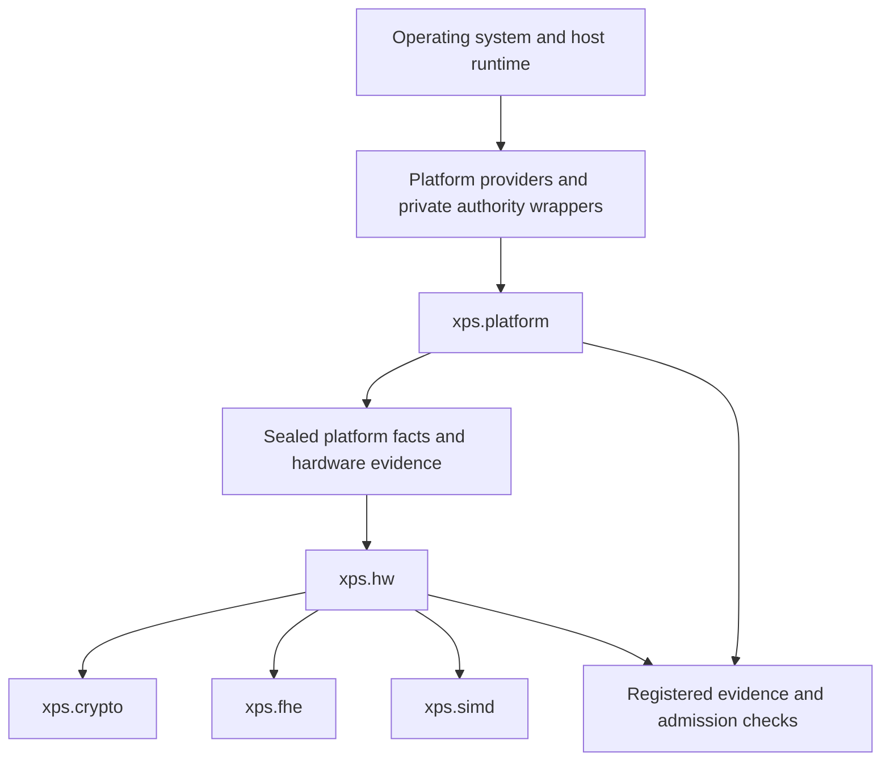
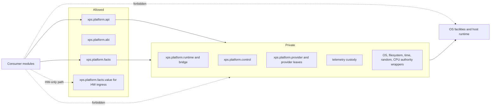
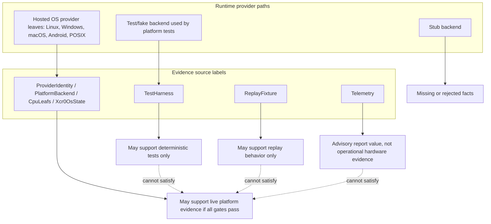
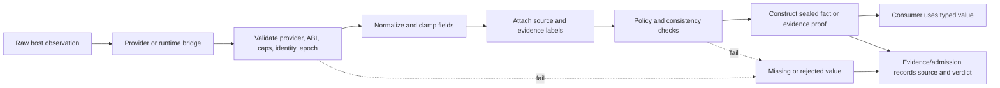
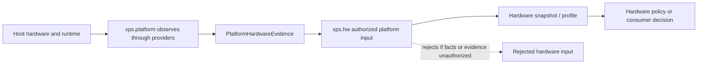

# xps.platform authority boundary guide

A reader usually meets `xps.platform` after asking a practical question: why can the hardware layer not read CPU information by itself? The answer is that raw host facts are not just inputs. They carry provenance, provider mode, runtime identity, and failure semantics. If several modules gather them independently, XPScerpto loses the ability to say which fact was observed, who observed it, how it was checked, and whether it was safe to use.

`xps.platform` centralizes that authority. It is the part of the repository that may observe host and operating-system state through controlled providers. It then exposes narrow value contracts instead of raw OS handles or provider internals.

## Where xps.platform sits

The diagram below shows the intended direction of authority. The operating system and host runtime are below `xps.platform`. Hardware, crypto, FHE, and SIMD code are above it. The arrows are not convenience dependencies; they are authority boundaries.



The important rule is that host observation flows upward through `xps.platform`; interpretation flows outward to consumers. `xps.hw` may decide what a hardware fact means for policy. It must not create that fact by reading CPUID, `/proc`, `/sys`, registry APIs, compiler ISA macros, or runtime host state directly.

## What xps.platform is

In plain language, `xps.platform` is the only XPScerpto unit allowed to build the project’s trusted view of the current host.

In the code, that role is split across several surfaces:

- `xps.platform.abi` defines backend status, capability, hook, extension, attestation, telemetry, hardware-probe, and topology value types without importing the platform implementation.
- `xps.platform.api` exposes the operational API: current platform identity, backend capability queries, memory and randomness calls, mitigation reports, attestation reports, telemetry reports, hardware probe reports, topology snapshots, and fact/evidence construction entry points.
- `xps.platform.facts` owns the sealed `PlatformFacts` and `PlatformHardwareEvidence` types, their verdicts, their source labels, their consistency checks, and their authorized/missing/rejected constructors.
- `xps.platform.facts.value` is the value bridge used by hardware-facing code. Repository policy treats that bridge as a hardware ingress contract, not as a general-purpose import for arbitrary modules.
- Provider, runtime, control, telemetry-custody, and raw authority modules sit below the public API and are not consumer surfaces.

The engineering consequence is simple: if a module needs platform truth, it consumes a typed platform value. It does not probe the host, keep a private provider, include a raw authority header, or infer platform truth from logs.


## Vocabulary used by this guide

The platform source uses a few terms in a strict way. The table gives the everyday meaning first, then the technical meaning, then the consequence for code review.

| Term | Plain idea | Technical meaning | Engineering consequence |
| --- | --- | --- | --- |
| Platform authority boundary | One place owns host observation. | The public/private split around platform API, provider selection, runtime identity, raw authority wrappers, fact sealing, and evidence emission. | Host facts must enter through `xps.platform`; consumers do not create private platform truth. |
| Sealed platform fact | A fact that carries its origin and validation result. | `PlatformFacts` or `PlatformHardwareEvidence` with schema, source, verdict, identity fields, consistency checks, and proof fields produced by the platform fact authority. | Struct shape is not enough. Unsealed or proof-mismatched values are not trusted truth. |
| Provider mode | The kind of path that produced an observation. | Source/evidence labels distinguish operational providers, bootstrap/control/runtime bridge, test harnesses, replay fixtures, telemetry, and missing/rejected sources. | Evidence from one mode cannot be silently reused as evidence for another mode. |
| Live provider | A provider observing the host through an OS-facing leaf. | Hosted Linux, Windows, macOS, Android, or POSIX provider paths registered through the platform provider registry. | Live closure requires live-provider evidence and all closure gates. |
| Mock or fake provider | A controlled provider used to make tests deterministic. | The reviewed source uses fake/test backends and test overrides under platform tests; it does not expose a general production mock provider as live authority. | Fake evidence may prove tests. It does not prove live runtime behavior. |
| Replay provider or replay fixture | A prior observation replayed for repeatability. | The reviewed platform source has replay fixture labels and court/fact rejection rules; no standalone production replay provider leaf was found. | Replay-labeled evidence cannot satisfy live runtime closure. |
| Test provider or test harness | A path owned by tests. | Test-only modules and source labels such as `TestHarness`. | Test evidence must stay labeled as test evidence. |
| Evidence receipt | A registered record used by review or admission. | Reports, generated evidence, source identity, manifests, authority scans, and court outputs that are scoped and registered by policy. | Unregistered logs, UI status, stdout/stderr, or model text are not closure evidence. |
| Fail-closed | Failure becomes an explicit block. | The source returns missing/rejected values, failed statuses, negative compile failures, policy failures, or court blockers. | Absence, uncertainty, or forbidden source cannot become implicit success. |
| Consumer module | Code that depends on platform truth. | `xps.hw`, crypto, FHE, SIMD, audit/court, and higher modules that consume typed values rather than raw host state. | Consumers use authorized facts or hardware interpretation; they do not probe the OS directly. |
| Admission gate | A claim boundary. | Configure, build, test, negative compile, provider separation, source identity, consumer boundary, fail-closed, and court/admission checks. | Strong platform claims are allowed only when every required gate has registered evidence. |

## What xps.platform is not

`xps.platform` does not decide every policy that depends on the machine. It supplies attributed facts and evidence; it does not own every interpretation.

It is not:

| Not owned by `xps.platform` | Owner or consequence |
| --- | --- |
| Cryptographic primitive implementation | Crypto modules own primitives. They must not use private OS probing as a side channel for policy. |
| FHE algorithm selection | FHE code uses authorized hardware/profile information through `xps.hw`; it does not probe platform state directly. |
| SIMD optimization policy | SIMD code uses the hardware authority path. It must not treat compiler macros or runtime probing as platform authority. |
| Hardware policy decisions | `xps.hw` interprets sealed hardware evidence. Platform observes and seals; hardware interprets. |
| Admission authority by itself | Court/admission code evaluates registered evidence and blockers. Platform can produce evidence, but reports and admission rules decide claims. |
| A success default for missing facts | Missing, partial, unsealed, unattributed, or invalid platform truth must fail closed unless a documented non-authoritative degraded mode is used. |

## The authority boundary

The source implements the boundary in layers. Public modules expose values and reports. Private modules wrap raw host authority. CMake policy and negative compile tests then make common bypasses fail at build time.



The boundary is implemented, but not by one mechanism alone. `platform.runtime.bridge.hpp` contains an include guard and an internal macro gate. Retired raw authority headers deliberately emit `#error` on direct inclusion. Provider foreign implementation files are not includable public headers. The import-policy CMake checks scan platform surfaces and higher modules for forbidden imports, private-header leaks, post-module includes, and raw authority exposure. Negative compile tests exercise bypass attempts and require the compiler to reject them for authority reasons rather than for accidental module-resolution failures.

A boundary violation is any path where a consumer creates platform truth without passing through the sealed platform contract. Examples include direct CPUID in `xps.hw`, `/proc` parsing in FHE autotuning, importing `xps.platform.provider` from a high-level module, including a retired `platform.*_authority.hpp` header, calling runtime-control mutation from outside the platform seam, or treating stdout/stderr/model output as evidence.


## Path and time authority

Path and time are platform facts when they are used to support authority. A path can escape the tree a reviewer thought was being scanned. A clock can fail or describe the wrong context. For that reason, the repository keeps filesystem and time access below platform authority seams instead of letting every module decide what is safe.

In source, the private `platform.filesystem_authority.ixx` and `platform.time_authority.ixx` modules wrap filesystem and monotonic-clock access for platform-owned code. The CMake policy layer also enforces report/source custody rules: report output must stay under declared roots, and source/report scans fail closed on symlink escape or unregistered source identity.

The implemented claim is intentionally narrow. The reviewed source proves platform-owned filesystem/time authority wrappers and policy-time custody checks. It does not prove a general runtime filesystem sandbox for every provider operation, and it does not expose a broad public sealed-time-fact API. The engineering consequence is that other modules must not use paths, clocks, or filesystem observations as private platform truth. If a clock or path observation is needed for a claim, it must be produced through the platform-owned path and covered by evidence; otherwise it remains non-authoritative.

## Public API and private implementation

A reader should treat the public API as the only supported way to interact with platform behavior. Its stability is source-governed rather than informal: changing these exported surfaces requires matching source-identity, tests, and evidence updates.

### Public surfaces

`xps.platform.abi` is a value contract. It defines statuses such as `PlatformErrc`, backend capabilities, hook tables, extension records, entropy reports, memory and process mitigation reports, attestation reports, hardware probe reports, topology reports, and telemetry reports. It also contains ABI and capability consistency checks such as `backend_abi_compatible` and `backend_caps_consistent`.

`xps.platform.api` is the operational entry point. It exposes current identity and backend capability queries; memory locking, no-dump, page-protection, secure wipe, randomness, and process-policy calls; attestation and telemetry report calls; hardware probe and topology calls; and the functions that return current authorized platform facts and hardware evidence. The API returns explicit statuses or rejected/missing fact values when a backend is unsupported, mismatched, stubbed, or unavailable.

`xps.platform.facts` is the fact authority. Its exported types have private raw constructors and const fields. Public callers can receive missing, rejected, or authorized facts through exported functions; they cannot manufacture arbitrary authorized facts by filling a struct. The module defines `FactSource`, `FactVerdict`, conflict bits, proof fields, validation helpers, and hardware-evidence consistency checks.

`xps.platform.facts.value` re-exports the value vocabulary needed by the hardware bridge. The source and CMake policy make this a restricted contract: it is for `xps.hw` ingress and related audited paths, not a shortcut for arbitrary consumers.

### Private surfaces

The private implementation includes provider leaves, provider registry internals, runtime bridge mutation, control installation/reset/freeze paths, telemetry custody, private fact-sealing internals, and raw authority wrappers for OS, filesystem, random, time, CPU, memory, and synchronization operations. These pieces must remain private because they carry the authority to observe or mutate the platform view.

The consequences of leaking them are concrete. Exposing `BackendVTable` storage or runtime bridge writers would let outside code install or mutate a backend without the provider registry and guard checks. Exposing raw authority wrappers would let consumers bypass source attribution, provider identity, and evidence labeling. Exposing private fact constructors would let a consumer create a fact that looks sealed without passing validation.

## Provider model: live, test, replay, and invalid sources

Provider mode matters because it tells a reviewer what kind of observation produced a fact. A live host observation, a fake test backend, a replay fixture, and a telemetry snapshot do not prove the same thing.



The hosted provider leaves are live OS-facing implementations. The source contains Linux, Windows, macOS, Android, and POSIX provider paths selected through the provider bootstrap layer and registered through `xps.platform.provider`. They call private authority modules or foreign OS shims; they do not expose those raw calls to consumers.

The test/fake provider path is for platform tests. `tests/platform/` and `xps.platform.runtime.testing` provide controlled fake backends and overrides, with the meaningful override behavior compiled only under the test-override build setting. A fake backend can prove provider routing and fail-closed behavior. It cannot prove live runtime behavior.

Replay and test-harness sources appear in the fact and court vocabularies. The code explicitly rejects `TestHarness` and `ReplayFixture` as operational evidence sources. That is an implemented safety rule. A separate production replay provider leaf was not found during this review; the implemented repository support is the source label and the rejection/admission rule, not a live replay-provider subsystem.

Unknown or invalid provider identity fails closed. Provider registration rejects null or malformed providers, bad ABI, inconsistent capability declarations, zero provider IDs, stack-like payloads, invalid extension tables, and conflicting duplicate provider definitions. Platform fact sealing rejects missing provider identity, missing epochs, invalid sources, stub providers, missing evidence source, forbidden evidence source, and mismatched proofs.

## How a platform fact is made

A raw observation is not a platform fact. It becomes usable only after it passes through provider validation, normalization, source attribution, policy checks, and sealing.



The source separates general platform facts from hardware evidence. `PlatformFacts` records provider identity, epoch, environment, runtime choices, and fact-source/proof fields. `PlatformHardwareEvidence` records architecture, vendor class, vector width, topology, risk, policy, evidence-source flags, confidence, and attestation-related fields. Both have missing and rejected states, and authorization requires the matching schema, operational source, nonzero identity fields, consistency checks, and a proof that matches the fact contents.

Normalization is visible in the fact module. Vector widths are clamped to an allowed set. Confidence and risk values are sanitized. Logical-thread count is guarded against zero. Hardware evidence that contradicts the platform facts, reports unsupported OS state for vector features, mixes forbidden evidence sources, or lacks required identity is rejected.

The rule this flow proves is narrower than “the platform knows everything about the host.” The implemented claim is that the platform has a typed, source-attributed, fail-closed contract for the platform facts it exposes. Any fact that is unsealed, unattributed, stale by epoch/proof mismatch, partial, unknown, or produced from a forbidden source must not cross a module boundary as trusted truth.

## Relationship with xps.hw

`xps.platform` observes and seals. `xps.hw` interprets.



`xps.hw.api` imports the platform value contract and validates caller-supplied `PlatformFacts` plus `PlatformHardwareEvidence` through `make_authorized_platform_input`. It does not acquire those facts from the operating system. If the platform facts or hardware evidence are not authorized, hardware returns a rejected/default path rather than silently trusting the observation.

This distinction is the reason direct CPU probing from hardware code is forbidden. If `xps.hw` reads CPU leaves or `/proc/cpuinfo` directly, the project loses a single source of provider identity, epoch, normalization, evidence-source labeling, and fail-closed rejection. Platform owns the observation. Hardware owns the interpretation.

## Relationship with crypto, FHE, and SIMD

Crypto, FHE, and SIMD code may depend on hardware information, but they do not own the authority to observe the operating system. The reviewed source shows downstream modules using `xps.hw.api` rather than importing private platform provider or runtime-control surfaces.

FHE autotuning is a useful example. The FHE code derives a hardware profile from authorized platform evidence through the hardware API. That keeps FHE algorithm selection from becoming a second platform authority. SIMD and selected crypto surfaces follow the same pattern: they consume hardware interpretation, not raw host state.

A higher module may still use ordinary language like “platform-dependent behavior,” but in this repository that does not mean “probe the platform here.” It means “consume the relevant typed authority object from the module that owns the observation or interpretation.”

## Evidence, telemetry, and audit layers

Telemetry is allowed as a report value, but the reviewed source does not treat telemetry as operational hardware evidence. The platform API can expose telemetry read/control/attestation reports. The fact and court layers reject telemetry as an operational evidence source for hardware closure. That distinction prevents advisory status data from becoming proof of platform truth.

Court and admission code sit above platform evidence. `xps.platform.court_layer` evaluates blockers such as missing report chains, accepted telemetry/test/replay evidence, HW re-signing seams, model/FCC/command-output authority, unaccounted source identity, and build-graph scope. Platform may produce evidence values, but admission is a separate evaluation step.

## Failure model

Platform failure must be explicit. The safe result is a rejected or missing value, a failed status, or an admission blocker. Silent success is not the platform model.

| Failure class | Condition | Expected response | Forbidden recovery | Evidence or admission effect |
| --- | --- | --- | --- | --- |
| Missing fact | Required provider, epoch, environment, or evidence source is absent. | Return a missing or rejected fact/evidence value. | Fill a safe-looking default and mark it authorized. | Missing evidence blocks platform closure. |
| Partial fact | Only some fields are present or consistency checks cannot be completed. | Reject or lower to a non-authoritative report path when the API defines one. | Cross module boundaries as trusted truth. | Partial matrices do not satisfy closure. |
| Stale or mismatched fact | Epoch, provider identity, environment, or proof does not match the active runtime view. | Reject with provider/evidence mismatch semantics. | Reuse the value as if it describes the current provider. | Provider mismatch blocks admission. |
| Unsealed fact | A caller tries to construct or pass fact-shaped data outside the sealing path. | Compile-time rejection where constructors/imports are private; runtime rejection for invalid proofs. | Treat struct shape as authority. | Negative compile and fact validation must fail the bypass. |
| Unknown provider | Provider ID is zero, ABI is bad, caps are inconsistent, or the provider is malformed. | Registration or activation fails; current facts reject stub/unknown providers. | Install the provider by raw pointer or private bridge access. | Provider separation evidence cannot pass. |
| Path or symlink escape | Report or scanned-source custody leaves the declared roots. | CMake policy fails closed. | Accept out-of-root logs as registered evidence. | Source/report custody gate fails. |
| Unavailable clock | A private time authority cannot produce a monotonic value. | Any consumer that needs authoritative time must treat the value as unavailable or rejected. | Convert zero/unknown time into success. | Time-dependent claims remain unproven unless evidence covers them. |
| Mock/live confusion | A fake, test-harness, replay, or telemetry source is used for live evidence. | Court/fact validation rejects operational use. | Use deterministic test evidence to claim live closure. | Live closure gate fails. |
| Unauthorized OS access | Consumer code imports private authority, reads `/proc`, calls CPUID, uses registry APIs, or probes compiler ISA macros for policy. | Import policy or negative compile tests reject the code; review treats it as a boundary violation. | Hide the access behind a utility helper. | Authority boundary gate fails. |
| Private header bypass | Code includes tombstoned authority headers, runtime bridge headers, private fact seal headers, or provider foreign implementation files. | Compile-time `#error`, import-policy failure, or negative compile rejection. | Publish private headers as supported API. | Private implementation gate fails. |
| Unregistered evidence | A log, UI status, stdout/stderr text, model output, or generated file is not registered and scoped. | It is not closure evidence. | Treat its presence as a pass. | Admission must fail closed. |
| Consumer boundary violation | `xps.crypto`, `xps.fhe`, `xps.simd`, or other sovereign modules create platform truth directly. | Policy scan or negative compile failure; design review blocks the change. | Add an exception without new evidence and admission rules. | Consumer boundary gate fails. |

## Correct and incorrect usage

Incorrect:

```text
xps.hw reads /proc/cpuinfo directly and decides whether AVX2 is safe.
```

Correct:

```text
xps.platform collects and seals hardware-related evidence. xps.hw consumes the sealed evidence through its authorized platform-input path and then decides what the evidence means.
```

Incorrect:

```text
A fake backend test passed, so the live platform provider is closed.
```

Correct:

```text
The fake backend proves deterministic provider-routing behavior. Live closure requires live-provider evidence labeled and registered as live evidence.
```

Incorrect:

```text
A missing platform fact is treated as a safe default because the caller wants conservative behavior.
```

Correct:

```text
The missing fact produces a missing or rejected platform value. A conservative downstream mode may exist only if it is documented as non-authoritative and does not claim platform truth.
```

Incorrect:

```text
FHE autotuning parses host CPU state because the algorithm needs vector width.
```

Correct:

```text
FHE asks the hardware layer for a profile derived from authorized platform facts and hardware evidence.
```

Incorrect:

```text
A module includes a provider foreign implementation file to reuse an OS helper.
```

Correct:

```text
The OS helper remains inside the provider leaf or private authority module. Public consumers receive status values, reports, or sealed facts.
```

## Source alignment summary

The main implementation anchors for this guide are:

| Claim | Source alignment |
| --- | --- |
| Public platform API and ABI are value/report surfaces. | `include/xps/crypto/platform/platform.api.ixx`, `include/xps/crypto/platform/platform.abi.ixx` |
| Fact constructors and hardware-evidence authorization are sealed and fail closed. | `include/xps/crypto/platform/facts.ixx`, `include/xps/crypto/platform/facts.value.ixx` |
| Provider registration validates identity, ABI, capabilities, extension tables, and duplicate semantics. | `include/xps/crypto/platform/platform.provider.ixx` |
| Runtime backend mutation is controlled and guarded. | `include/xps/crypto/platform/platform.runtime.ixx`, `include/xps/crypto/platform/platform.control.ixx`, `include/xps/crypto/platform/platform.runtime.bridge.hpp` |
| OS access is below provider/private authority seams. | `include/xps/crypto/platform/provider.*.foreign.cpp`, `include/xps/crypto/platform/platform.*_authority.ixx` |
| Direct raw authority headers are tombstoned. | `include/xps/crypto/platform/platform.*_authority.hpp` |
| Hardware consumes platform evidence rather than probing directly. | `include/xps/crypto/hw/api.ixx`, `include/xps/crypto/hw/api_facade.cppm`, `include/xps/crypto/hw/api.cppm` |
| FHE and SIMD consume hardware authority rather than private platform providers. | `include/xps/crypto/FHE/fhe.autotune.ixx`, `include/xps/crypto/simd/` |
| Import and private-header violations are scanned. | `cmake/CheckPlatformImportPolicy.cmake`, `cmake/CheckPlatformStdlibAuthorityPolicy.cmake` |
| Boundary bypass attempts are compiled as negative tests. | `tests/platform/platform_c1c2_negative_compile_harness.py`, `tests/CMakeLists.txt` |
| Court/admission rejects telemetry, test-harness, replay, model, FCC, command-output, and HW re-signing seams as authority. | `include/xps/crypto/platform/platform.court_layer.ixx` |

