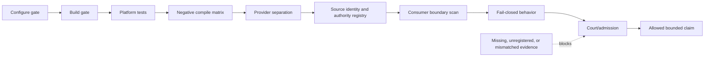
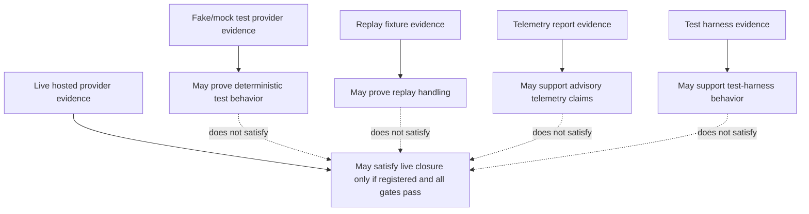
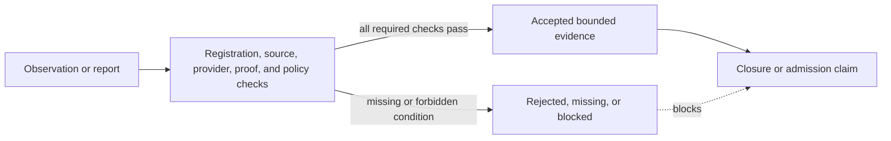

# xps.platform evidence and closure guide

Evidence is the difference between “the code appears to work” and “the repository can make a bounded claim.” For `xps.platform`, evidence must show not only that calls succeed, but that the platform boundary was preserved: the right provider was used, the fact was sealed, forbidden sources were rejected, consumer modules did not probe the host directly, and the result was registered where admission can evaluate it.

A platform document is not evidence by itself. A log is not evidence by itself. A mock run is not live evidence. This guide explains what the source and existing reports support, what they do not support, and what must be true before a closure claim is allowed.

## What counts as platform evidence

The repository uses several kinds of evidence for the platform boundary. They are related, but they answer different questions.

| Evidence kind | Question it answers | Source alignment reviewed |
| --- | --- | --- |
| Configure evidence | Was the platform-scoped build configured with the intended gates and options? | `CMakeLists.txt`, `reports/xps_platform_build_and_test_report.md` |
| Build evidence | Did the platform-scoped graph compile? | `CMakeLists.txt`, `reports/xps_platform_build_and_test_report.md` |
| Platform test evidence | Did platform API, provider, runtime, and boundary tests pass? | `tests/platform/`, `tests/CMakeLists.txt`, platform reports |
| Negative compile evidence | Are forbidden imports, raw authority paths, private constructors, and consumer bypasses rejected by the compiler/policy harness? | `tests/platform/platform_c1c2_negative_compile_harness.py`, `reports/fcc_deep/negative_compile_report.json` |
| Provider separation evidence | Are stub, fake/test, registered provider, malformed provider, and conflicting provider cases separated? | `tests/platform/platform_provider_control_test.cpp`, `tests/platform/platform_provider_matrix_test.cpp` |
| Source identity evidence | Are platform files and documentation registered with stable hashes and owners? | `cmake/platform_source_identity_manifest.cmake`, `cmake/CheckPlatformStdlibAuthorityPolicy.cmake` |
| Authority registry evidence | Are raw authority classes mapped to exact owners and files rather than wildcard authority? | `cmake/platform_authority_registry.cmake`, `cmake/CheckPlatformStdlibAuthorityPolicy.cmake` |
| Consumer boundary evidence | Do higher modules avoid importing private platform providers, control paths, or raw OS authorities? | `cmake/CheckPlatformImportPolicy.cmake`, negative compile harness, `include/xps/crypto/hw/api.ixx` |
| Sanitizer evidence | Did platform-scoped sanitizer runs pass when required by the closure policy? | Existing platform reports mention ASAN/UBSAN and TSAN gates; this documentation round did not rerun them. |
| Admission evidence | Did the court/admission layer evaluate blockers and accept only registered evidence? | `include/xps/crypto/platform/platform.court_layer.ixx`, `reports/xps_platform_court_verdict.md` |

The important point is that no single row proves the whole boundary. A build can pass while a boundary rule is missing. A negative test can pass while live-provider evidence is absent. A report can claim a result, but admission still depends on whether the report is registered, current, relevant, and sufficient.

## Closure gate flow

The closure path is a chain. A later gate cannot repair an earlier gap by rephrasing it.



The rule shown here is intentionally strict: `PLATFORM_FINAL_CLOSED=YES` or an equivalent final platform-closure claim is forbidden unless every required gate is satisfied by registered evidence. Existing reports in this repository use `MODULE_FINAL_CLOSURE=YES` for the platform module while also denying full-repository closure, production readiness, security completion, and external audit completion. Those denials are part of the evidence model, not fine print.

## Provider mode and evidence labels

Provider identity must be visible where it matters. A fact from a live provider, a fake test backend, a replay fixture, or telemetry custody carries a different evidentiary meaning.



The source enforces this distinction in two places. The fact layer rejects forbidden operational evidence sources such as telemetry, test-harness, and replay fixture sources. The court layer treats acceptance of telemetry, test-harness, replay, model output, FCC output, command output, or HW re-signing seams as blockers.

A terminology note matters here. The source contains fake/test provider machinery and source labels for replay and test-harness evidence. This review did not find a general production “mock provider mode” or a live replay provider leaf that can satisfy runtime closure. These documents therefore describe mock/replay support only to the extent the repository implements or rejects it: fake/test providers support tests; replay and test-harness labels are recognized and barred from operational live evidence.

## Failure and evidence

Fail-closed behavior has an evidence consequence. If a fact is missing, stale by provider/epoch/proof mismatch, partial, unsealed, or sourced from a forbidden mode, the correct outcome is not “pass with a warning.” The correct outcome is a rejected/missing value, failed status, test failure, policy failure, or admission blocker.



This is why unregistered logs cannot close the module. If evidence is not registered, scoped, and connected to the gate it claims to prove, it is just a record. It may help debugging, but it does not satisfy admission.

## Allowed and forbidden claims

The current repository contains platform reports that claim a platform module closure result and explicitly deny broader claims. Documentation must preserve that shape.

| Claim | Status in this documentation | Reason |
| --- | --- | --- |
| `xps.platform` is the OS-facing platform fact authority boundary. | Implemented. | Public/private source split, provider seams, fact sealing, import policy, and negative compile tests align with this claim. |
| Other modules must not directly probe OS or host runtime state for platform truth. | Implemented for reviewed platform/HW/FHE/SIMD paths and policy scans; future modules still require scan coverage. | CMake policy and negative tests protect known surfaces. |
| `xps.hw` consumes sealed platform evidence and interprets it. | Implemented. | `xps.hw.api` validates `PlatformFacts` and `PlatformHardwareEvidence` through the platform value contract. |
| Mock/fake provider evidence proves live closure. | Forbidden. | Fake/test provider paths are test evidence only. |
| Replay evidence proves live runtime closure. | Forbidden. | Replay fixture sources are blocked as operational evidence. |
| Telemetry alone proves hardware/platform authority. | Forbidden. | Telemetry is advisory/reporting; fact and court layers reject it as operational evidence. |
| Missing logs mean success. | Forbidden. | Evidence registration and admission require positive scoped evidence. |
| Full repository closure is complete. | Forbidden by existing platform reports. | Existing reports deny full-repository closure. |
| Production readiness is proven. | Forbidden by existing platform reports. | Existing reports deny production-ready claims. |
| Security is complete or externally audited. | Forbidden. | Existing reports deny security-complete and external-audit claims. |

## Existing reports and how to read them

The repository includes platform reports under `reports/` and repair evidence under `evidence/platform/`. During this documentation round they were reviewed as repository artifacts, not re-created.

Important files include:

| File | How it should be read |
| --- | --- |
| `reports/xps_platform_build_and_test_report.md` | Existing platform configure/build/test and policy-evidence summary. It reports a platform-scoped pass set and names relevant gates. |
| `reports/xps_platform_final_closure_report.md` | Existing closure statement for the platform module. It also denies full-repository closure, production readiness, security completion, and external audit completion. |
| `reports/xps_platform_court_verdict.md` | Existing court/admission-style verdict for the platform module, with the same non-claim boundaries. |
| `reports/xps_platform_policy_proof.md` | Existing policy proof for authority and evidence restrictions. |
| `reports/fcc_deep/negative_compile_report.json` | Existing negative compile evidence for forbidden FCC/platform boundary paths. |
| `evidence/platform/xps_platform_boundary_repair_matrix.json` | Earlier repair matrix. It is useful for traceability but should not be treated as a final closure claim by itself. |

Because this documentation round did not perform a full fresh release, ASAN/UBSAN, or TSAN rebuild, the documentation does not independently restate those runs as newly executed evidence. It records that the repository contains existing reports that make those claims, and it keeps stronger admission language conditional on registered, relevant, current evidence.

## What blocks closure

A platform closure or admission claim must fail closed when any of the following is true:

- The configure or build gate is missing.
- Platform-scoped tests are skipped, partial, or unregistered.
- Negative compile tests do not run, do not cover the relevant bypass, or pass for accidental module-resolution reasons rather than authority rejection.
- A provider source is unknown, malformed, zero-identified, mismatched, or not registered.
- Mock, test-harness, replay, telemetry, stdout/stderr, command output, FCC output, UI status, or model output is used as operational evidence.
- Source identity or authority-registry scans are missing or stale after source changes.
- A consumer module directly probes OS, CPU, filesystem, registry, compiler ISA macros, runtime host state, or private platform providers.
- A fact is missing, partial, unsealed, inconsistent, or proof-mismatched.
- Documentation claims stronger status than registered evidence supports.

## How to verify after a change

For a platform source or documentation change, a reviewer should expect at least the following workflow:

```sh
cmake -S . -B build-platform -GNinja -DXPS_PLATFORM_UNIT_ONLY=ON -DCMAKE_BUILD_TYPE=Release
cmake --build build-platform
ctest --test-dir build-platform --output-on-failure
```

The exact CI invocation may add sanitizer, court-only, closure-only, or FCC probe modes. The source contains options for platform-only, closure-only, court-claim-only, and FCC probe runs; use the mode required by the admission claim being made.

After adding or changing a file that is part of platform source identity, update `cmake/platform_source_identity_manifest.cmake` with the new path, owner, kind, class, and SHA-256. Do not treat an unregistered generated file, report, or document as evidence.
